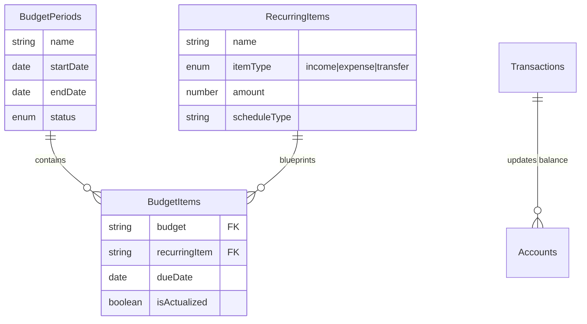

# Budget Management System - Data Model Documentation

## Overview

This Payload CMS application manages your home budget using a **Relational Pattern** on top of MongoDB. While MongoDB is document-oriented, this application normalizes data into separate collections to allow for flexible management of recurring items and independent budget tracking.

## Key Concepts

### 1. **Unified Templates** (`RecurringItems`)
Instead of separate collections for income, expenses, and transfers, all recurring definitions are stored in a single `RecurringItems` collection.
- **Discriminator**: The `itemType` field ('income', 'expense', 'transfer') determines which specific fields are available.
- **Purpose**: These serve as the blueprints. They define *what* should happen regularly.

### 2. **Budget Periods** & **Budget Items** (`BudgetPeriods` + `BudgetItems`)
A **Budget Period** is simply a container with a date range and a status. It does *not* contain the items directly.
- **BudgetItems**: These are separate documents that link *to* a Budget Period.
- **The Link**: `BudgetItems.budget` -> `BudgetPeriods.id`
- **The Source**: `BudgetItems.recurringItem` -> `RecurringItems.id`
- **Workflow**: When you create a budget period, you (or automation) create `BudgetItems` that reference that period.

### 3. **Transactions** (Actuals & Logic)
Transactions represent the actual movement of money.
- **Side Effects**: Creating or updating a Transaction triggers Payload **Hooks** to update the `currentBalance` of the related `Accounts`.
- **Reconciliation**: Transactions can be linked to `BudgetItems` to mark them as "Actualized".

## Data Model Diagram

## Collection Reference

### 1. RecurringItems (The Blueprints)
The master list of everything that happens regularly.
- **Fields**: `name`, `amount`, `itemType`, `scheduleType`
- **Polymorphic Fields**:
    - If `income`: `incomeCategory`, `payee`, `account` (deposit to)
    - If `expense`: `expenseCategory`, `payee`, `account` (pay from)
    - If `transfer`: `fromAccount`, `toAccount`

### 2. BudgetPeriods (The Container)
Defines the "Bucket" of time (e.g., "Dec 15 Paycheck").
- **Fields**: `name`, `startDate`, `endDate`, `status` (Planning/Active/Closed), `account` (Primary account view)

### 3. BudgetItems (The Contents)
The intersection of "When" (BudgetPeriod) and "What" (RecurringItem).
- **Fields**:
    - `budget`: Relation to `BudgetPeriods`
    - `recurringItem`: Relation to `RecurringItems`
    - `dueDate`: Specific date for this instance
    - `isActualized`: Boolean (Has it happened?)
    - `transaction`: Optional link to the actual transaction

### 4. Transactions (The History)
The immutable record of money moving.
- **Fields**: `date`, `type`, `amount`, `account`
- **Logic**: `afterChange` and `afterDelete` hooks automatically recalculate `Accounts.currentBalance` based on these records.

### Configuration Collections
These remain standard reference collections:
- **Schedules**: (Weekly, Bi-weekly, etc.)
- **Accounts**: (Checking, Savings) - holds `currentBalance`
- **Payees** & **Categories**: Classification tags.

## Usage Workflow

1.  **Define Templates**: Create `RecurringItems` for your Salary (Income) and Rent (Expense).
2.  **Start a Cycle**: Create a `BudgetPeriods` document (e.g., "Jan 1 - Jan 15").
3.  **Populate**: (Currently Manual/Future Automation) Create `BudgetItems` linked to that Budget Period, based on your `RecurringItems`.
4.  **Track**: As bills get paid, creating `Transactions` updates your account balance. You then check off `isActualized` on the `BudgetItem`.
